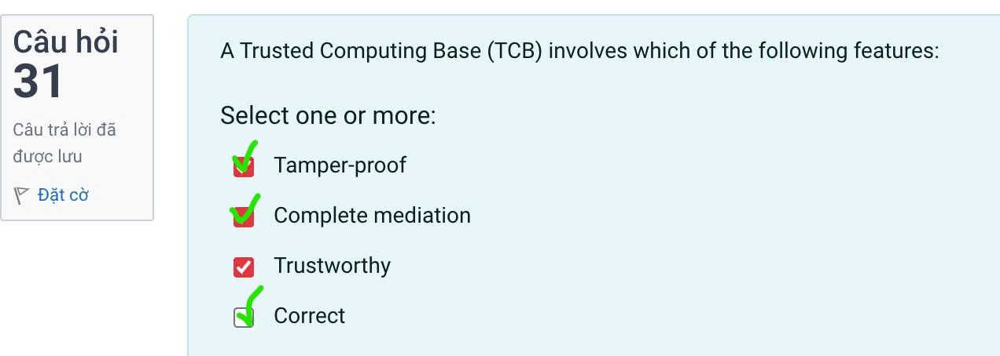
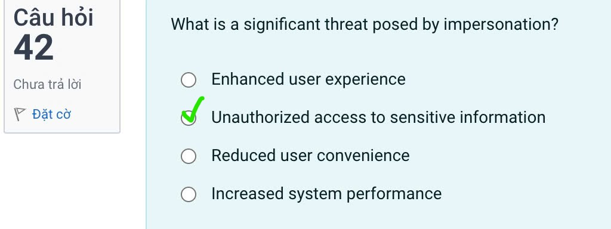

# The question

## 1. The protection measure used is (are)

## 2. Which example illustrates an organization's reponsibility to comply with an individual's right to correct their personal data?

## 3. The protection measure used is (are)

## 4. What technique is commonly used to ensure data integrity?

## 5. What is CSRF in web security?

## 6. A hacker gains access to a company's financial records, modifies them, and then deletes the original files. Which security goals are violated?

- Confidentiality:

Đảm bảo tính bí mật của thông tin, tức là thông tin chỉ được phép truy cập (đọc) bởi những đối tượng (người, chương trình máy tính…) được cấp phép.

- Integrity

Đảm bảo tính toàn vẹn của thông tin, tức là thông tin chỉ được phép xóa hoặc sửa bởi những đối tượng được phép và phải đảm bảo rằng thông tin vẫn còn chính xác khi được lưu trữ hay truyền đi. 

Ngoài ra, một giải pháp “data integrity” có thể bao gồm thêm việc xác thực nguồn gốc của thông tin này (thuộc sở hữu của đối tượng nào) để đảm bảo thông tin đến từ một nguồn đáng tin cậy và ta gọi đó là tính “authenticity” của thông tin.

- Availability

Đảm bảo độ sẵn sàng của thông tin, tức là thông tin có thể được truy xuất bởi những người được phép vào bất cứ khi nào họ muốn. 

## 7. What kind of vulnerability in the following code snippet?

- In-band SQLi:

  - Error-based SQLi: Đầu tiên, kẻ tấn công sẽ cài một đoạn mã độc để hệ thống cơ sở dữ liệu báo lỗi. Sau đó hacker sẽ dùng dữ liệu thu thập được từ những thông báo này để truy xuất ra thông tin của cấu trúc cơ sở dữ liệu.

  - Union-based SQLi: Bằng cách lợi dụng toán tử UNION SQL, hacker sẽ tiến hành hợp nhất các câu lệnh được tạo ra từ cơ sở dữ liệu để thu được một HTTP response. Trong response sẽ chứa thông tin riêng tư mà kẻ tấn công nhắm đến.
- Inferential (Blind) SQLi:
  - Boolean: Đầu tiên, kẻ xấu sẽ gửi một câu truy vấn SQL đến cho server. Khi đó, cơ sở dữ liệu buộc phải gửi trả lại kết quả để trả lời cho câu lệnh này. Đáp án có thể là đúng hoặc sai. 
  - Time-based: Cách thức tấn công này cũng tương tự như Boolean. Hacker sẽ dùng những câu lệnh SQL làm server ngừng hoạt động trong vài giây. Sau đó từ mốc thời gian phản hồi tra ra được kết quả của các truy vấn. Như vậy, một HTTP response đã được tạo ra.

## 8. Which of the following Java code snippets is safe against SQL injection?

## 9. What is the primary goal of secure coding?

## 10. Identify correct type of vulnerability in following code?

- DOM - Based XSS: chèn document object vào
- Reflected XSS: chèn script vào
- CSRF: thức hiện dựa trên cookie của user, đưa 1 link vào để user bấm vào

## 11. What kind of vulnerability the following code snippet does exhibit?

- SQL inject: k dùng query
- XSS: k có lệnh script nèo
-> CSRF: k có xác thực user

## 12. How can continuous monitoring help in mitigating the risks of impersonation?

## 13. The protection measure used is (are)

## 14. What is the technique behind the -fno-stack-protector gcc option

## 15. What kind of vulnerability in the following code snippet?

## 16. The protection measure used is (are):

## 17. Which of the following best describes a Tamper-Proof feature in an operating system? 

- Operating System with a robust design, as not to allow the execution of malicious code. Access to internal data and procedures are never allowed without the proper authorization. In its more strict implementations, this Operating System will have attack detection mechanisms. If the attack is of a certain level, the Operating System may even delete all its code and/or data.

## 18. What can lead to increased regulatory scrutiny for organizations that fail to uphold information privacy standards?

## 19. John has security clearance as TOP-SECRET in Misc. Affairs Department. What can you state about John's office access control policy?

- Discretionary Access Control (DAC): người tạo tệp có quyền chỉ định quyền truy cập của riêng họ và có thể chỉ định các tham số chia sẻ với bất kỳ người nhận nào mà họ chỉ định
- Mandatory access control (MAC):  phổ biến trong chính phủ và các tổ chức được quản lý chặt chẽ. Các chủ thể chỉ có thể truy cập các đối tượng nằm trong hệ thống phân cấp được xác định của chúng
- Rule-based access control (RUBAC): thường được sử dụng với thiết bị mạng. Chúng áp dụng như nhau cho tất cả các đối tượng
- Role-based access control (RBAC): uses roles and user groups to phân loại các điều khiển truy cập. Với RBAC, quản trị viên hệ thống chỉ định vai trò cho chủ thể và định cấu hình quyền truy cập để áp dụng ở cấp vai trò. Dựa trên vai trò của chủ thể, quyền truy cập tài nguyên sẽ tự động được cấp hoặc từ chối

## 20. What is the primary purpose of multi-factor authentication (MFA)?

## 21. What kind of vulnerability in the following code snippet?

## 22. Which security goals are violated for the following cases (answer text may be in whichever case)

## 23. Which of the following is a key principle of defensive programming?

## 24. The protection measure used is (are)

## 25. What is a secure bootloader in Operating Systems?

## 26. What is a common method to prevent SQL injection attacks in secure coding?

- Prevent SQL injection attacks: Techniques like input validation, restricting database user privileges, and using parameterized queries are essential.

## 27. Which of the following belong to the rule-based access control

## 28. In the context of SQL injection, what type of attack does the following input represent?

## 29. What does Correctness in the context of OS security mean?

## 30. Which type of damage can result from a data breach or privacy violation for an organization?

## 31. A Trusted Computing Base (TCB) involves which of the following features:

## 32. What does the principle of Complete Mediation ensure in an operating system?

## 33. The protection measure used is (are)

## 34. What is a primary responsibility of organizations in terms of transparency regarding personal data?

## 35. Which of these inputs is an example of a boolean-based blind SQL injection attack?

## 36. What is the SameSite attribute in cookies?

## 37. Which of the following is a privacy concern specific to social media, similar to a personal diary?

## 38. Which of the following security levels are used to classify documents in the Mandatory Access Control system?

- Users and Data are given a clearance level (confidential, secret, top secret)

## 39. Which type of vulnerability does expose in following code?

- htmlentities($_POST['string'], ENT_QUOTES, 'UTF-8') to clean data for any XSS attacks
- method="GET" to avoid CSRF

## 40. The protection measure used is (are)

## 41. Choose correct layout of stack memory

## 42. What is a significant threat posed by impersonation?

