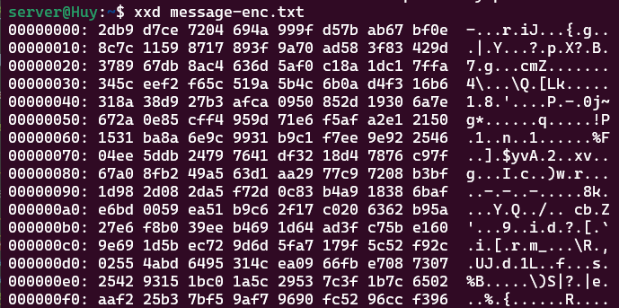
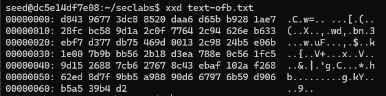

# Lab #2,22110033, Le Minh Huy, INSE331280E_02FIE
# Task 1: Public-key based authentication 
**Question 1**: 
Implement public-key based authentication step-by-step with openssl according the following scheme.


**Answer 1**:

## 1. Client generate private key named `privatekey.pem`:

```sh
openssl genrsa -out privatekey.pem 2048
```


## 2. Client generate public key name `publickey.pem`:

```sh
openssl rsa -in privatekey.pem -outform PEM -pubout -out publickey.pem
```


## 3. Client sends to server public key:

*CLient and user are running in the same machine so the address will be the same as `172.18.51.42`.*\
*Client sends file `publickey.pem` to server with `scp` command*

```sh
scp -r /home/client/publickey.pem server@172.18.51.42:/home/server
```


*In server machine, we now have `publickey.pem` file*


## 3. Server create a challenge message file named `message.txt`:

*First, we write a challenge message and save it in a text file:*

```sh
echo "Bad times have a scientific value. These are occasions a good learner would not miss." > message.txt
```


## 4. Server encrypts the file using RSA with received public key:

*Encrypted message will be outputed in `message-enc.txt`*

```sh
openssl pkeyutl -encrypt -inkey publickey.pem -pubin -in message.txt -out message-enc.txt
``` 

## 5. View the encrypted file using `xxd`:

```sh
xxd message-enc.txt
```



Hex bytes of encrypted file can clearly be seen in the screenshot.

## 6. Server sends to Client encrypted message:

```sh
scp -r /home/server/message-enc.txt client@172.18.51.42:/home/client/
```


## 7. Client decrypts received encrypted message:

```sh
openssl pkeyutl -decrypt -inkey privatekey.pem -in message-enc.txt -out message.txt
```


## 8. Client signs decrypted message with private key:

```sh
openssl dgst -sha256 -sign privatekey.pem -out message.txt.signature message.txt
```

## 9. Then, client sends signed decrypted message to the server:

```sh
scp -r /home/client/message.txt.signature server@172.18.51.42:/home/server/
```


## 10. Server verify received message by using public key:

```sh
openssl dgst -sha256 -verify publickey.pem -signature message.txt.signature message.txt
```


*The return of verify function is `OK` so the message is authenticated*

# Task 2: Encrypting large message

Create a text file at least 56 bytes.

**Question 1**:
Encrypt the file with aes-256 cipher in CFB and OFB modes. How do you evaluate both cipher as far as error propagation and adjacent plaintext blocks are concerned.

**Answer 1**:

## 1. Let create a text file named `text.txt`:

*The requirement of the file is at least 56 bytes using python*

```sh
python -c "print '1234567890' * 10" > text.txt
```

*To check file size, using `ls`*

```sh
ls -l text.txt
```


*File's size is 101*

## 2. Encrypt file with AES-256 in CFB and OFB modes:

*Key is `0123456789ABCDEF0123456789ABCDEF0123456789ABCDEF0123456789ABCDEF` and iv is `0123456789ABCDEF0123456789ABCDEF`*

*Following command will encrypt `text.txt` in `CFB mode`*

```sh
openssl enc -aes-256-cfb -e -in text.txt -out text-cfb.txt -K 0123456789ABCDEF0123456789ABCDEF0123456789ABCDEF0123456789ABCDEF -iv 0123456789ABCDEF0123456789ABCDEF
```


*Following command will encrypt `text.txt` in `OFB mode`*

```sh
openssl enc -aes-256-ofb -e -in text.txt -out text-ofb.txt -K 0123456789ABCDEF0123456789ABCDEF0123456789ABCDEF0123456789ABCDEF -iv 0123456789ABCDEF0123456789ABCDEF
```



CFB Mode:

- Has error propagation where an error in one bit affects the current plaintext block and subsequent blocks.

- There is a dependency between adjacent plaintext blocks, leading to changes in subsequent ciphertext blocks if one plaintext block changes.

OFB Mode:

- Does not have error propagation beyond the affected bit in the current block.

- Each plaintext block is encrypted independently, so changes in one block do not affect the others.

---

**Question 2**:
Modify the 8th byte of encrypted file in both modes (this emulates corrupted ciphertext).
Decrypt corrupted file, watch the result and give your comment on Chaining dependencies and Error propagation criteria.

**Answer 2**:

## 1. Lets modify 8th byte of the encrypted file in CFB modes:

*As you know above, the output of cfb is `text-cfb.txt` and ofb is `text-ofb.txt`*

*In this case, I will use a website hex editor named `https://hex-works.com` to modify the 8th byte of the encrypted files*

*After import the `text-cfb.txt` the screen will can be seen below. The 8th byte is marked in red*


*Modify the 8th byte from `29` to `20`*


*Save and then store to the working folder*

## 2. Alter the 8th byte in OFB modes:

*We will do the same as above*


*Save and then store to the working folder*

## 3. Decrypt altered files:

*Following command will decrypt `text-cfb.txt` into `text-cfb-dec.txt`*

```sh
openssl enc -aes-256-cfb -d -in text-cfb.txt -out text-cfb-dec.txt -K 0123456789ABCDEF0123456789ABCDEF0123456789ABCDEF0123456789ABCDEF -iv 0123456789ABCDEF0123456789ABCDEF
```

*Following command will decrypt `text-ofb.txt` into `text-ofb-dec.txt`*

```sh
openssl enc -aes-256-ofb -d -in text-ofb.txt -out text-ofb-dec.txt -K 0123456789ABCDEF0123456789ABCDEF0123456789ABCDEF0123456789ABCDEF -iv 0123456789ABCDEF0123456789ABCDEF
```

## 4. Watch the resulf after decrypt altered files:

```sh
cat text-cfb-dec.txt
```


```sh
cat text-ofb-dec.txt
```


*In conclusion, `CFB Mode` In CFB mode, the encryption of each plaintext block depends on the previous ciphertext block. When a single bit is corrupted in the ciphertext, it affects the corresponding bit in the decrypted plaintext block, as well as the corresponding bit in the next plaintext block. So, the error propagation only affects the next block, not subsequent blocks. Thus, in this case, the corruption will affect the 8th byte in the decrypted plaintext, as well as the corresponding bit in the next block. The remaining information in the decrypted plaintext will be intact. In my case, The incorrect plaintext is 1234567190123456`EB�r�ܟ��̗�a��`34567890123456789012345678901234567890123456789012345678901234567890*

*However, `OFB Mode` a keystream is generated independently of the plaintext and used to encrypt the plaintext. When a single bit is corrupted in the ciphertext, it only affects the corresponding bit in the decrypted plaintext block. The keystream generation is not affected by the corruption, so the error propagation does not propagate to subsequent blocks. In short, only the 55th byte in the decrypted plaintext will be incorrect, and the rest of the information will be recovered successfully. In my case, The incorrect plaintext is 1234567`1`90123456789012345678901234567890123456789012345678901234567890123456789012345678901234567890 which should be `8`*