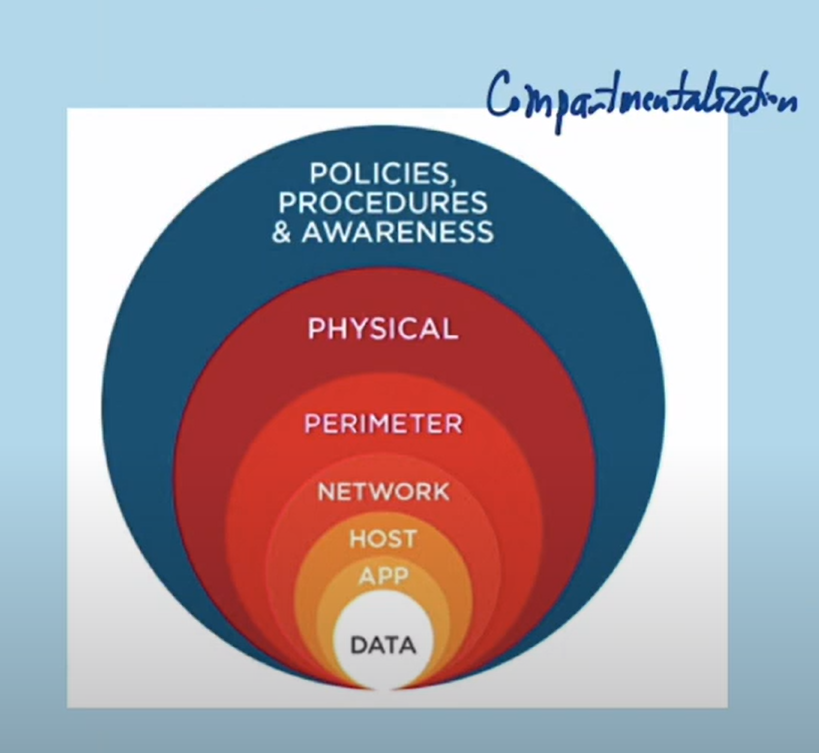
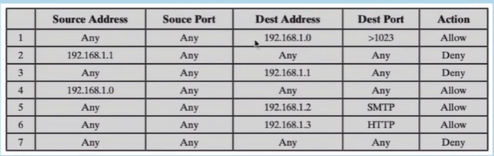
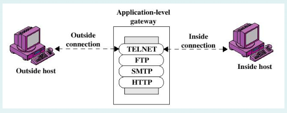
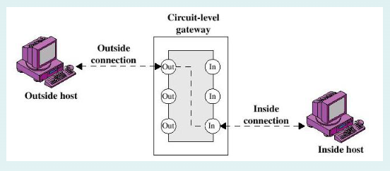

# Chapter 6: Firewalls & IDS

## Explain the role of Firewalls (FWs) as part of a computer & network sercurity strategy

### Perimeter (phòng thủ ngoại biên) and Internal Defenses (phòng thủ bên trong) / Của hệ thống mạng

Các lớp phòng thủ phổ biến:

- Perimeter defenses: Firewalls, IDS
- Protect LAN and hosts
- Keep external threats from internal network

Phòng thủ bên trong - Virus scanning

- Bảo vệ người dùng khỏi những xâm nhập vượt qua được phòng thủ ngoại biên

### What is a Firewall?

- Điểm kiểm soát và giám sát hệ thống mạng
- Interconnects (kết nối giữa các mối quan hệ với nhau) networks of differing trust
- Imposes (áp đặt) restrictions on network services
- Auditing (kiểm tra tổng quan) and controlling access | log lại nội dung truy cập
- Provides perimeter defense | bảo vệ mạng ngoại vi

### Defense in depth | Compartmentation

Nguyên tắc thiết kế an toàn

1. Policies, Procedures & Awareness | Chính sách, quy trình, đào tạo nhân viên nhận biết về an toàn thông tin
2. Physical | Bảo vệ vật lý: bảo vệ hệ thống server khỏi bị xâm nhập, tấn công về mặt vật lý
3. Perimeter | Bảo vệ ngoại vi
4. Network | Bảo vệ mạng
5. Host | Bảo vệ server
6. App | Bảo vệ app
7. Data | Bảo vệ dữ liệu

### Design goals

1. Enforcement (thực thi) of security policies | Tăng cường an ninh, chính sách
   1. All traffic (lưu lượng dữ liệu) from internal network to the internet, and vice versa (và vân vân), must pass through the firewall
   2. Only traffic authorized by policy is allowed to pass
2. Robust (mạnh mẽ)
   1. The firewall itself is immune (miễn nhiễm) to crash of disable by an attack

### Firewall limitations

Firewall cannot protect:

- Traffic that does not cross it
- When misconfigure (cấu hình sai)

### Four general control techniques

4 kỹ thuật kiểm soát tổng quát

- Service control
  - Determines the types of Internet services that can be accessed, inbound (nhiều lần truy cập) or outbound (lần đầu truy cập)
- Direction control
  - Determines the direction in which particular service requests are allowed to flow
- User control
  - Controls access to service according to which user is attemping (trying) to access it
- Behavior control
  - Controls how particular services are used (e.g filter e-mail)

### Firewall Access Policy

- List the types of traffic authorized to pass through the firewall, including: address range, protocols, applications and content types
- Developed by the organization's information sercurity risk assessment (đánh giá) and policy

### Firewall and Filtering

- Hoạt động chính của firewalls là lọc (gói) - traffic filtering
- Mỗi một gói tin đi qua firwall sẽ được kiểm tra chính sách bảo mật. Sau đó firewall sẽ quyết định cho phép hay bỏ gói tin đó.
- Các gói tin theo hướng đi vào hay đi ra đêò được firewall kiểm soát

### Filtering types

- Packet filtering (per packet): Chính sách của Firewall là tập hợp của danh sách kiểm soát truy cập trên từng loại gói tin (e.g kiểm soát dựa trên địa chỉ nguồn, địa chỉ đích, cổng nguồn, cổng đích, các cờ, gói tin có bị phân mảnh hay không?,....)
- > stateless
- Session filtering (per session): Một gói tin được kiểm tra dựa trên nội dung của chúng trong một session
- > stateful

## Types of Firewalls

1. Packet-filtering routers | FW loại lọc từng gói tin
2. Application-level gateways | FW hoạt động ở tầng ứng dụng
3. Circuit-level gateways | FW hoạt động trên mạch

### Packet filtering firewall

Thiết lập một tập các luật trên FW. Khi một luồng thông tin đi qua FW đó thì sẽ lấy từng gói tin và kiểm tra các giá trị trên gói tin với các luật đã được thiết lập. Sau đó đưa ra quyết định cho phép hay không.

- Nếu mà gói tin thỏa một trong những điều luật thì luật đó sẽ xác định rằng gói tin đó sẽ được thông qua hay bị hủy bỏ
- Nếu mà không thỏa với bất kỳ luật nào được soạn ra trong luật thì default action sẽ được thực thi
- Two default policies:
  - Hủy bỏ: Ngăn cấm trừ khi được thông hành một cách tường minh
  - Chuyển tiếp: Cho phép đến khi bị ngăn cấm một cách tường minh

### Packet filtering advantages

- Đơn giản
- Trong suốt đối với người dùng - người dùng không biết đến
- Thực thi rất nhanh chóng

### Packet filtering weaknesses

- Không thể chống được những cuộc tấn công / mã độc ở tầng application
- Không thể chống được những cuộc tấn công được phân ra ở nhiều gói tin (lợi dụng TCP/IP)

### Packet filtering vulnerabilities

Có thể bị tấng công và cách phòng chống:

- IP Address spoofing (giả mạo)
- Source routing attack
- Tiny fragment attack

### Application-level Gateway

Còn được gọi là proxy-server

Hành động như là một trạm trung chuyển của các gói tin ở lớp ứng dụng (application-level)

### Application-level firewall

Advantages:

- Bảo mật hơn packet filters
- Chỉ cần xem xét một vài ứng dụng cho phép
- Log và kiểm soát một cách đơn giản tất cả các lưu lượng đến

Disadvantages:

- Thêm quy trình trước mỗi kết nối

### Circuit-level Gateway

- Hệ thống độc lập hoặc một hàm chuyên biệt được thực hiện bởi một application-level gateway
- Cài đặt cho 2 kết nối TCP
- Gateway thường trung chuyển thành phần TCP từ một kết nối này đến kết nối khác mà không cầm xem xét nội dung
- Hàm bảo mật bao gồm việc xác định kết nối nào sẽ được cho phép
- Thường được dùng như là một tình huống trong đó hệ thống quản trị tin tưởng người dùng bên trong
- Một ví dụ cho SOCKS package (Socket secure là một phương thức mà proxy server sử dụng gói mạng route giwuax server và một người dùng. SOCKS5 also provides authentication, allowing only authorized users to access the server.)

### Bastion Host (Host tiên phong/pháo đài)

- Một hệ thống được xác định bởi firewall adminstrator như là một điểm trọng yếu trong an ninh mạng
- Bastion host hành xử như là một nền tảng cho một application-level hoặc circuit-level gateway

### Firewall Configurations

...