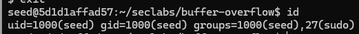

# Lấy quyền root cho shell

chạy docker:
`docker run -it --privileged -v $HOME/Seclabs:/home/seed/seclabs img4lab`
dùng lệnh id để kiếm tra user hiện tại là gì\
\
copy lệnh id về thư mục hiện tại bằng\
tìm địa chỉ của lệnh id
`where id`
trả về `/usr/bin/id`\
coy lệnh id về thư mục và đổi tên thành myid
`cp /usr/bin/id myid`\
(xoá gì đó bằng lệnh `rm` và kiểm tra xem có tồn tại không bằng\
`ls -l [tên chương trình hoặc thư mục]`)\
đổi quyền sở hữu của lệnh myid cho root (gốc là user seed)\
`sudo chown root myid`\
đổi quyền thực thi của lệnh myid thành 4755\
`sudo chmod 4755 myid`\
kiểm tra lại file bằng `ls -l myid`\
`-rwsr-xr-x 1 root seed 38716 Sep 17 04:05 myid` và myid sẽ có màu đỏ bao quanh - s trong rwsr là supervisor\
chạy thử lệnh bằng `./myid`\
trả về là: `uid=1000(seed) gid=1000(seed) euid=0(root) groups=1000(seed),27(sudo)`\
làm tương tự với file sh (đã có sẵn trong week 2)\
