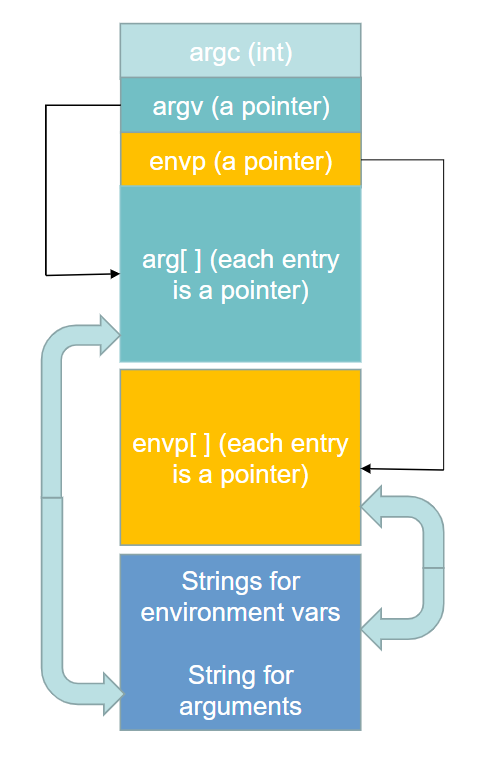

# OS Security

1. Trusted Computer Base (TCB):

- Complete mediation:

- Tamper-proof: Chống bị xâm phạm
	- Protect-mode
	- Filesystem
	- User mode | System mode
- Correctness: Đảm bảo sai thì cũng không ảnh hưởng gì tới máy (Defensive Coding, Secure coding)
2. Linux known OS vulnerabilities:
- Environment variables: Biến môi trường là các biến mà máy sẽ sử dụng trong các chương trình (Ex: Path là địa chỉ dẫn tới user, %appdata% là địa chỉ dẫ tới local roaming etc...) thường thì sẽ được viết hoa\
Trường hợp trong linux thì có thể dùng các lệnh như `whereis` để tìm được đỉa chỉ lưu của câu lệnh / biến của hệ thống.
- Vị trí của các biến môi trường: phía trước stack frame của hàm main sẽ là nơi lưu trữ của các biến môi trường.\
\
Khai báo biến trong linux bằng [tên biến]=[giá trị biến]\
Ex: `MYVAR=/bin/sh`\
Nhưng biến này sẽ không xuất hiện trong chương trình khi chạy\
Và biến được khai báo trong chương trình sẽ không xuất hiện trong linux\
Để biến có thể xuất hiện thì dùng lệnh (trong gdb)\
`Export MYVAR = /bin/sh`\
